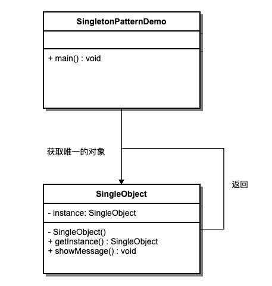

# 单例模式

## 一、介绍

属于创建型模式。

**注意：**

- 1、单例类只能有一个实例。
- 2、单例类必须自己创建自己的唯一实例。
- 3、单例类必须给所有其他对象提供这一实例。

#### 1. 意图

保证一个类仅有一个实例，并提供一个访问它的全局访问点。

#### 2. 主要解决

一个全局使用的类频繁地创建与销毁。

#### 3. 何时使用

控制实例数目，节省系统资源。

#### 4. 如何解决

判断系统是否已经有这个单例，如果有则返回，如果没有则创建。

#### 5. 关键代码

构造函数是私有的。

#### 6. 应用实例

操作一个文件避免通过多个线程操作。

#### 7. 优点

① 在内存里只有一个实例，减少了内存的开销，尤其是频繁的创建和销毁实例（比如管理学院首页页面缓存）；

② 避免对资源的多重占用（比如写文件操作）。

#### 8. 缺点

没有接口，不能继承，与单一职责原则冲突，一个类应该只关心内部逻辑，而不关心外面怎么样来实例化。

#### 9. 使用场景

① 要求生产唯一序列号；

② WEB 中的计数器，不用每次刷新都在数据库里加一次，用单例先缓存起来；

③ 创建的一个对象需要消耗的资源过多，比如 I/O 与数据库的连接等。

**注意事项：**getInstance() 方法中需要使用同步锁 synchronized (Singleton.class) 防止多线程同时进入造成 instance 被多次实例化。

## 二、实现

